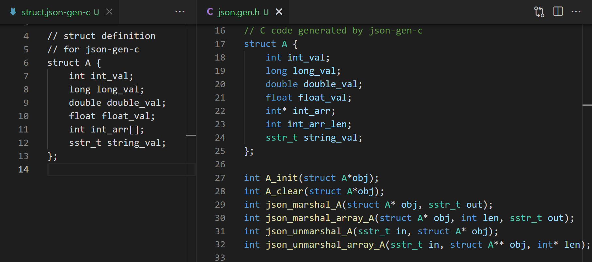

json-gen-c
---

一个可以生成 JSON 处理代码的程序。

    

`json-gen-c` 通过读取结构体 (`struct`) 定义文件，生成对应的 JSON 处理代码。这些代码包括 `struct` 结构体定义，结构体初始化和清理函数，结构体 JSON 编码和解码函数。

# 编译

使用下列命令构建并安装：

	make
	sudo make install

# 使用示范

1. 编辑 `struct.json-gen-c` 文件，内容如下

```C
// 结构体定义文件

// 定义结构体 A
struct A {
    // 定义成员变量
    int int_val1;
    int int_val2;
    long long_val;
    double double_val;
    float float_val;
    sstr_t sstr_val;
    // 还可以定义数组
    int int_val_array[];
    // 定义别的结构体类型的变量
    B b_val;
};

// 定义结构体 B
struct B {
    int id;
};
```

2. 构建 `json.gen.c` 和 `json.gen.h`

使用下列命令创建 `json` 处理代码：

	json-gen-c -in struct.json-gen-c -out .

命令创建了 `json.gen.c` 和 `json.gen.h` 文件，其中包含了 `json` 处理代码。同时创建了他们依赖的 `sstr.h` 和 `sstr.c`，这是用于字符串处理的代码，程序中大量地方使用了他们。

3. 使用 `json` 处理代码
例如要解析 JSON 字符串到结构体 `A`：

```C
// const char *p_str = "this is a json string";
// sstr_t json_str = sstr(pstr);

struct A a;
A_init(&a);
unmarshal_A(json_str, &a); // 注意 json_str 是 sstr_t 类型的
// ...
A_clear(&a);
```

要解析 JSON 字符串到结构体 `A` 的数组 `A a[]`:

```C
// const char *p_str = "this is a json string";
// sstr_t json_str = sstr(pstr);

struct A *a = NULL;
int len = 0;
unmarshal_array_A(&a, &len, json_str); // 注意 json_str 是 sstr_t 类型的
// ...
int i;
for (i = 0; i < len; ++i) {
    A_clear(&a[i]);
}
free(a);
```

要将结构体 `A` 序列化成 JSON 字符串:

```C
struct A a;
A_init(&a);
// set values to a ...
// ...
sstr_t json_str = sstr_new();
marshal_A(&a, json_str);

printf("marshal a to json> %s\n", sstr_cstr(json_str));

sstr_free(json_str);
A_clear(&a);
```

要将结构体数组 `A a[]` 序列化成 JSON 字符串：

```C
struct A a[3];
for (i = 0; i < 3; ++i) {
    A_init(&a[i]);
    // set values to a[i] ...
}

sstr_t json_str = sstr_new();
marshal_array_A(a, 3, json_str);

printf("marshal a[] to json> %s\n", sstr_cstr(json_str));

for (i = 0; i < 3; ++i) {
    A_clear(&a[i]);
}
```
