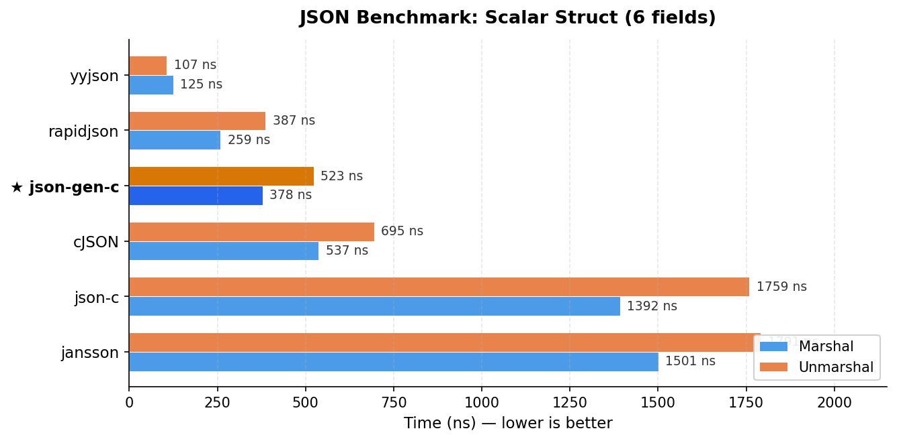

json-gen-c
---

[](https://github.com/zltl/json-gen-c/actions/workflows/test.yml)

> Fast, tiny, and friendly code generator that turns your C structs into fully featured JSON serializers/deserializers.

## Highlights

- **Schema-first workflow** – describe your structs once, generate battle-tested C code automatically.
- **Zero runtime reflection** – everything happens at compile time, so the generated code stays fast and lean.
- **Thread-safe runtime** – the parsing context uses explicit structures rather than globals.
- **Batteries included** – includes a lightweight `sstr` string helper library and ready-made array helpers.
- **CI-friendly build** – warnings are treated as errors and the Make targets work the same locally and in automation.

## Benchmark



json-gen-c is **faster than cJSON** on all benchmarks — 10% faster marshal, 26% faster unmarshal — while providing type-safe code generation, selective parsing, and multi-format support (JSON + MessagePack + CBOR). See [benchmark/RESULTS.md](benchmark/RESULTS.md) for full results and reproduction steps.

## Contents

- [Benchmark](#benchmark)
- [Overview](#overview)
- [Build and Install](#build-and-install)
- [Quick Start](#quick-start)
- [The Format of Structs Definition File](#the-format-of-structs-definition-file)
- [The JSON API](#the-json-api)
- [More Resources](#more-resources)
- [Contributing & Community](#contributing--community)

## Overview

json-gen-c is a program for serializing C structs to JSON and
deserializing JSON to C structs. It parses struct definition files
then generates C code to handle both directions.


- [Document](https://zltl.github.io/json-gen-c/)

## Build and Install

```bash
make
sudo make install
```

The project uses a modern, efficient build system with support for parallel compilation:

```bash
# Parallel build (recommended)
make -j$(nproc)

# Debug build
make debug

# Build with sanitizers
make sanitize

# Show build configuration
make show-config
```

To build example, tests, and benchmarks

```bash
# build ./build/example/example
make example
# build ./build/test/unit_test
make test
# build ./build/benchmark/json_bench
make benchmark
# Debian/Ubuntu one-command benchmark reproduction
make benchmark-repro
```

`make benchmark-repro` installs the distro benchmark dependencies when needed,
clones `yyjson` into `benchmark/yyjson/`, installs it locally under
`benchmark/.deps/prefix/`, then builds and runs the full benchmark suite with
`-O2 -DNDEBUG`. Both local dependency directories are gitignored on purpose.

All build artifacts are organized under the `build/` directory:
- `build/bin/` - Main executable
- `build/lib/` - Static libraries  
- `build/example/` - Example executable
- `build/test/` - Test executables
- `build/benchmark/` - Benchmark executable

### Alternative Build Systems

**CMake** (3.16+):

```bash
mkdir build-cmake && cd build-cmake
cmake ..
cmake --build . -j$(nproc)
sudo cmake --install .
```

**Windows (CMake + MSVC)**:

```cmd
mkdir build && cd build
cmake ..
cmake --build . --config Release
```

**Windows (CMake + MinGW)**:

```cmd
mkdir build && cd build
cmake .. -G "MinGW Makefiles"
cmake --build .
```

> Note: On Windows, CMake automatically uses a built-in `xxd` replacement (`cmake/xxd.cmake`). No external tools beyond a C compiler and CMake are needed.

**Meson**:

```bash
meson setup builddir
ninja -C builddir
sudo ninja -C builddir install
```

See [BUILD_SYSTEM.md](BUILD_SYSTEM.md) for pkg-config integration, `find_package(JsonGenC)`, and the `json_gen_c_generate()` CMake macro.

### Package Managers

**Homebrew** (macOS/Linux):

```bash
brew install zltl/tap/json-gen-c
```

To set up the tap, see [`packaging/homebrew/`](packaging/homebrew/).

**Debian/Ubuntu** (from source package):

```bash
# Install build dependencies
sudo apt install build-essential debhelper devscripts xxd

# Build the .deb
cp -r packaging/debian .
dpkg-buildpackage -us -uc -b
sudo dpkg -i ../json-gen-c_*.deb
```

**Arch Linux (AUR)**:

```bash
# Using an AUR helper
yay -S json-gen-c

# Or manually
cd packaging/aur
makepkg -si
```

## Quick Start

[example](./example/example.json-gen-c)

### Define Structs

For example, create a file name `struct.json-gen-c` as contents below:

```C
struct A {
    int int_val1;
    int int_val2;
    long long_val;
    double double_val;
    float float_val;
    sstr_t sstr_val;
    int int_val_array[];
    int fixed_data[10];
    B b_val;
};

struct B {
    int id;
};
```

Note that we don't use C-style string `char*`, a more resonable type is 
`sstr_t`. You can find more details about `sstr_t` in 
[document of sstr](https://zltl.github.io/json-gen-c/sstr_8h.html).

### Compiling Your Struct Definition File

```bash
json-gen-c -in struct.json-gen-c -out .
```

This generates the following files in your specified destination directory:

- `json.gen.h`, the header which declares your generated structures
  and functions.
- `json.gen.c`, which contains the implementation of your functions.
- `sstr.h`, `sstr.c`, the string manipulation helper functions that 
  generated code depends on.

#### MessagePack Format

To generate MessagePack (binary) serialization instead of JSON:

```bash
json-gen-c --format msgpack -in struct.json-gen-c -out .
```

This generates `msgpack.gen.h` and `msgpack.gen.c` with `msgpack_pack_*` / `msgpack_unpack_*` functions.
The struct definitions and `sstr` helper are identical regardless of format.

#### CBOR Format

To generate CBOR (RFC 8949) binary serialization:

```bash
json-gen-c --format cbor -in struct.json-gen-c -out .
```

This generates `cbor.gen.h` and `cbor.gen.c` with `cbor_pack_*` / `cbor_unpack_*` functions.
Same struct definitions and API patterns as JSON and MessagePack.

### C++ Wrapper (Optional)

```shell
json-gen-c --cpp-wrapper -in struct.json-gen-c -out .
```

This generates `json_gen_c.gen.hpp` — a C++17 header with RAII wrapper classes
inside `namespace jgc`. Each class wraps a generated C struct with:

- Default constructor (`_init`), destructor (`_clear`), move and copy semantics
- Typed get/set accessors (strings as `std::string`, enums as their C enum type)
- `marshal()`, `unmarshal()`, and `unmarshal_into()` member functions
- Equality operators and `c_struct()` for C interop

```cpp
#include "json_gen_c.gen.hpp"

jgc::Person p;
p.set_name("Alice");
p.set_age(30);

std::string json = p.marshal();                   // serialize
jgc::Person p2 = jgc::Person::unmarshal(json);    // deserialize
assert(p == p2);                                   // compare
struct ::Person& c = p.c_struct();                 // C interop
```

Can be combined with `--format` to also generate MessagePack or CBOR alongside.

### Rust Module (Optional)

```shell
json-gen-c --rust -in struct.json-gen-c -out .
```

This generates `json_gen_c.gen.rs` — a self-contained Rust module with native
`serde`-compatible structs and enums. Add `serde` and `serde_json` to your
`Cargo.toml`, then:

```rust
mod json_gen_c_gen; // or rename as you like
use json_gen_c_gen::*;

let p = Person { name: "Alice".into(), age: "30".into() };
let json = serde_json::to_string(&p).unwrap();         // serialize
let p2: Person = serde_json::from_str(&json).unwrap();  // deserialize
assert_eq!(p, p2);
```

Type mapping: `int`→`i32`, `long`→`i64`, `float`→`f32`, `double`→`f64`,
`sstr_t`→`String`, enums→Rust enums, `oneof`→`#[serde(tag)]` enums,
`optional`→`Option<T>`, arrays→`Vec<T>`/`[T; N]`, maps→`HashMap<String, V>`.

### Go Source (Optional)

```shell
json-gen-c --go -in struct.json-gen-c -out .
```

This generates `json_gen_c.gen.go` — a self-contained Go source file using
`encoding/json` struct tags. No external dependencies required:

```go
package main

import (
    "encoding/json"
    "fmt"
    "your_module/gen"
)

func main() {
    p := gen.Person{Name: "Alice", Age: "30"}
    data, _ := json.Marshal(p)              // serialize
    var p2 gen.Person
    json.Unmarshal(data, &p2)               // deserialize
    fmt.Println(p2.Name)                    // "Alice"
}
```

Type mapping: `int`→`int32`, `long`→`int64`, `float`→`float32`, `double`→`float64`,
`sstr_t`→`string`, enums→`type E string`, `oneof`→custom marshal/unmarshal,
`optional`→`*T` + `omitempty`, arrays→`[]T`/`[N]T`, maps→`map[string]V`.

### Use Your Generated Codes

#### To Serialize Structs to JSON
```C
struct A a;
A_init(&a);
// set values to a ...
// ...
sstr_t json_str = sstr_new();
json_marshal_A(&a, json_str);

printf("marshal a to json> %s\n", sstr_cstr(json_str));

sstr_free(json_str);
A_clear(&a);
```

#### To Serialize Array of Structs to JSON

```C
struct A a[3];
for (i = 0; i < 3; ++i) {
    A_init(&a[i]);
    // set values to a[i] ...
}

sstr_t json_str = sstr_new();
json_marshal_array_A(a, 3, json_str);

printf("marshal a[] to json> %s\n", sstr_cstr(json_str));

for (i = 0; i < 3; ++i) {
    A_clear(&a[i]);
}
```

#### To Deserialize JSON to Structs
```C
// const char *p_str = "{this is a json string}";
// sstr_t json_str = sstr(pstr);

struct A a;
A_init(&a);
json_unmarshal_A(json_str, &a); // json_str is a type of sstr_t
// ...
A_clear(&a);
```

#### To Deserialize JSON to Array of Structs

```C
// const char *p_str = "[this is a json string]";
// sstr_t json_str = sstr(pstr);

struct A *a = NULL;
int len = 0;
json_unmarshal_array_A(json_str, &a, &len);
// ...
int i;
for (i = 0; i < len; ++i) {
    A_clear(&a[i]);
}
free(a);
```

#### To Selectively Deserialize Top-Level Fields

```C
struct User user;
User_init(&user);

uint64_t mask[User_FIELD_MASK_WORD_COUNT] = {0};
JSON_GEN_C_FIELD_MASK_SET(mask, User_FIELD_email);
JSON_GEN_C_FIELD_MASK_SET(mask, User_FIELD_scores);

json_unmarshal_selected_User(json_str, &user,
                             mask, User_FIELD_MASK_WORD_COUNT);
```

Selective unmarshal only updates the chosen top-level fields that are present in
the JSON input. Unselected top-level fields stay unchanged.

Selected fields are treated as whole-field replacements: if a selected field is a
string, array, map, nested struct, or oneof, its previous stored value is cleared
before the new JSON value is parsed.

#### To Selectively Deserialize Nested Sub-Fields

Use the `_deep` variant to pass sub-field masks into nested structs:

```C
struct User user;
User_init(&user);

// Select top-level "profile" field
uint64_t mask[User_FIELD_MASK_WORD_COUNT] = {0};
JSON_GEN_C_FIELD_MASK_SET(mask, User_FIELD_profile);

// Only parse Profile.name inside the nested struct
uint64_t inner[Profile_FIELD_MASK_WORD_COUNT] = {0};
JSON_GEN_C_FIELD_MASK_SET(inner, Profile_FIELD_name);

struct json_nested_mask nested[] = {
    { User_FIELD_profile, inner, Profile_FIELD_MASK_WORD_COUNT, NULL, 0 }
};
json_unmarshal_selected_User_deep(json_str, &user,
                                  mask, User_FIELD_MASK_WORD_COUNT,
                                  nested, 1);
```

When `nested_masks` is `NULL` or no entry matches a field, the nested struct is
parsed in full (same as the non-deep API). Sub-masks can be chained recursively
via the `sub_masks` / `sub_mask_count` members for deeper nesting levels.

Field-mask constants use the generated **C field names**, even when `@json`
aliases change the JSON key names.

## Build System

For detailed build system documentation, see [BUILD_SYSTEM.md](BUILD_SYSTEM.md).
If you are new to the project, the friendly walkthrough in [docs/GETTING_STARTED.md](docs/GETTING_STARTED.md) covers installation, schema authoring, and integration.

## The Format of Structs Definition File

Define a struct like:

```
struct <struct_name> {
    <field_type> <field_name> []?;
    <field_type> <field_name> []?;
    ...
};
```

The field type can be one of the following:

- `int`
- `long`
- `float`
- `double`
- `sstr_t`
- `bool`
- an enum name
- a struct name
- a oneof name (tagged union)
- `map<sstr_t, V>` where V is any of the above types

If a field is a dynamic array, just append `[]` after the field name. For fixed-size arrays, use `[N]` where N is a positive integer (e.g., `int data[10];`).

### Map fields

Map fields marshal to/from JSON objects. The key type is always `sstr_t` (JSON keys are strings). Example:

```
map<sstr_t, int> scores;       // single map: {"alice":95,"bob":87}
map<sstr_t, int> tags[];       // array of maps: [{"x":1},{"y":2}]
```

In generated C code, each map is represented as a dynamic array of key-value entries:

```c
struct json_map_int { struct json_map_entry_int* entries; int len; };
```

### Tagged unions (oneof)

Tagged unions (discriminated unions) represent a value that can be one of several types,
identified by a discriminator tag field in JSON:

```
struct Circle {
    float radius;
}

struct Rectangle {
    float width;
    float height;
}

oneof Shape {
    @tag "type"
    Circle circle;
    Rectangle rectangle;
}
```

- `@tag "field"` sets the JSON discriminator key (defaults to `"type"` if omitted).
- Each variant references a previously defined struct.
- JSON uses a flattened representation: `{"type":"circle","radius":5.0}`.

### `@deprecated` Annotation

Mark fields, enum values, or oneof variants as deprecated:

```
struct Config {
    int timeout_ms;
    @deprecated int timeout_sec;  // use timeout_ms instead
};

enum Status { ACTIVE, @deprecated INACTIVE, ARCHIVED };
```

Deprecated items remain fully functional in marshal/unmarshal. The generated C code
annotates them with compiler deprecation attributes so downstream code that accesses
them gets a warning. See [doc/schema-evolution.md](doc/schema-evolution.md) for
migration patterns and compatibility rules.

Oneof types can be used as fields in structs:

```
struct Drawing {
    sstr_t name;
    Shape shape;       // scalar oneof
    Shape shapes[];    // dynamic array of oneof
}
```

## The JSON API

```C
// initialize a struct
// always return 0
int <struct_name>_init(struct <struct_name> *obj);

// uninitialize a struct
// always return 0
int <struct_name>_clear(struct <struct_name> *obj);

// marshal a struct to json string.
// return 0 if success.
int json_marshal_<struct_name>(struct <struct_name>*obj, sstr_t out);

// marshal an array of struct to json string.
// return 0 if success.
int json_marshal_array_<struct_name>(struct <struct_name>*obj, int len, sstr_t out);

// unmarshal a json string to a struct.
// return 0 if success.
int json_unmarshal_<struct_name>(sstr_t in, struct <struct_name>*obj);

// unmarshal a json string to array of struct
// return 0 if success.
int json_unmarshal_array_<struct_name>(sstr_t in, struct <struct_name>**obj, int *len);

// generated top-level field indices
enum <struct_name>_field_index {
    <struct_name>_FIELD_<field_name> = 0,
    ...
    <struct_name>_FIELD_COUNT = N
};

// number of uint64_t words needed for the field mask
#define <struct_name>_FIELD_MASK_WORD_COUNT ...

// selectively unmarshal chosen top-level fields
int json_unmarshal_selected_<struct_name>(
    sstr_t in,
    struct <struct_name> *obj,
    const uint64_t *field_mask,
    int field_mask_word_count);

// selectively unmarshal with nested sub-field masks
int json_unmarshal_selected_<struct_name>_deep(
    sstr_t in,
    struct <struct_name> *obj,
    const uint64_t *field_mask,
    int field_mask_word_count,
    const struct json_nested_mask *nested_masks,
    int nested_mask_count);
```

Use the generated helper macros to manage mask bits:

```C
JSON_GEN_C_FIELD_MASK_SET(mask_words, field_index);
JSON_GEN_C_FIELD_MASK_CLEAR(mask_words, field_index);
JSON_GEN_C_FIELD_MASK_TEST(mask_words, field_index);
```

For `json_unmarshal_selected_<struct_name>()` and `_deep()`:

- passing `NULL` or too few mask words returns an error
- unselected top-level fields are left unchanged
- selected fields that appear in the JSON input replace the old stored field value
- field indices use C member names, not aliased JSON key names
- `_deep` additionally accepts `json_nested_mask` entries for sub-field selection within nested structs

## Editor Support

### VS Code Extension

The `editors/vscode/` directory contains a VS Code extension providing:

- **Syntax highlighting** — TextMate grammar for `.json-gen-c` files (keywords, types, annotations, etc.)
- **Language Server** — Real-time diagnostics, code completion, and hover information

To enable the language server, ensure `json-gen-c` is on your PATH (or set `jsonGenC.serverPath` in VS Code settings), then install the extension. It launches `json-gen-c --lsp` automatically.

### LSP for Other Editors

Any LSP-capable editor can use the built-in language server:

```sh
json-gen-c --lsp
```

This runs an LSP server over stdin/stdout (JSON-RPC 2.0). Configure your editor to launch it as a language server for `.json-gen-c` files.

## More Resources

- [docs/GETTING_STARTED.md](docs/GETTING_STARTED.md) – step-by-step tutorial with code snippets.
- [example/](example/) – real schemas plus sample host programs.
- [Online reference](https://zltl.github.io/json-gen-c/) – API documentation generated via Doxygen.
- [doc/json-gen-c.1](doc/json-gen-c.1) – manual page installed with the CLI.
- [doc/schema-evolution.md](doc/schema-evolution.md) – schema evolution guide (compatibility rules, migration patterns, `@deprecated`).

## Contributing & Community

We welcome issues, ideas, documentation updates, and code contributions.

- Read the [CONTRIBUTING.md](CONTRIBUTING.md) guide for local setup, coding style, and pull-request tips.
- File bugs or feature requests via [GitHub Issues](https://github.com/zltl/json-gen-c/issues) with clear reproduction details.
- Share what you build! Open a discussion or PR if you want your project added to a future showcase section.

Thanks for helping json-gen-c grow. Happy hacking!

## License

Codes of `json-gen-c` are licensed under GPL-3.0, except for the codes it
generated. The copy right of the codes generated by `json-gen-c` is owned
by the user who wrote the struct definition file, same as the copy right of
a PDF file generated by Latex is owned by the user who wrote the tex file.
