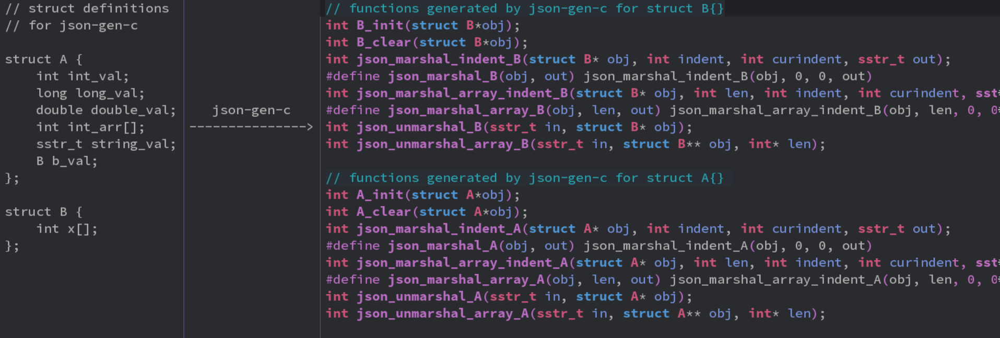

json-gen-c
---

[](https://github.com/zltl/json-gen-c/actions/workflows/test.yml)

## Overview

json-gen-c is an easy mechanism for searializing C struct to JSON and
deserializing JSON to C struct back. It parse structs' definition file
then generate C code to serialize and deserialize the structs.



## Build and install

```bash
make
sudo make install
```

## Quick start

[example](./example/example.json-gen-c)

### Define Structs

For example, create a file name `struct.json-gen-c` as contents below:

```C
struct A {
    int int_val1;
    int int_val2;
    long long_val;
    double double_val;
    float float_val;
    sstr_t sstr_val;
    int int_val_array[];
    B b_val;
};

struct B {
    int id;
};
```

### Compiling Your json-gen-c File

```bash
json-gen-c -in struct.json-gen-c -out .
```

This generates the following files in your specified destination directory:

- `json.gen.h`, the header which declares your generated structures
  and functions.
- `json.gen.c`, which contains the implementation of your functions.
- `sstr.h`, `sstr.c`, the string manipulation helper functions that 
  generated code depends on.

### Use Your Generated Codes

#### To Serialize Structs to JSON
```C
struct A a;
A_init(&a);
// set values to a ...
// ...
sstr_t json_str = sstr_new();
json_marshal_A(&a, json_str);

printf("marshal a to json> %s\n", sstr_cstr(json_str));

sstr_free(json_str);
A_clear(&a);
```

#### To Serialize Array of Structs to JSON

```C
struct A a[3];
for (i = 0; i < 3; ++i) {
    A_init(&a[i]);
    // set values to a[i] ...
}

sstr_t json_str = sstr_new();
json_marshal_array_A(a, 3, json_str);

printf("marshal a[] to json> %s\n", sstr_cstr(json_str));

for (i = 0; i < 3; ++i) {
    A_clear(&a[i]);
}
```

#### To Deserialize JSON to Structs
```C
// const char *p_str = "{this is a json string}";
// sstr_t json_str = sstr(pstr);

struct A a;
A_init(&a);
json_unmarshal_A(json_str, &a); // 注意 json_str 是 sstr_t 类型的
// ...
A_clear(&a);
```

#### To Deserialize JSON to Array of Structs

```C
// const char *p_str = "[this is a json string]";
// sstr_t json_str = sstr(pstr);

struct A *a = NULL;
int len = 0;
json_unmarshal_array_A(&a, &len, json_str);
// ...
int i;
for (i = 0; i < len; ++i) {
    A_clear(&a[i]);
}
free(a);
```

## The Format of Structs Definition File

Define a struct like:

```
struct <struct_name> {
    <field_type> <field_name> []?;
    <field_type> <field_name> []?;
    ...
};
```

The field type can be one of the following:

- `int`
- `long`
- `float`
- `double`
- `sstr_t`
- a struct name

If a field is an array, just append `[]` after the field name.

## The JSON API

```C
// initialize a struct
// always return 0
int <struct_name>_init(struct <struct_name> *obj);

// uninitialize a struct
// always return 0
int <struct_name>_clear(struct <struct_name> *obj);

// marshal a struct to json string.
// return 0 if success.
int json_marshal_<struct_name>(struct <struct_name>*obj, sstr_t out);

// marshal an array of struct to json string.
// return 0 if success.
int json_marshal_array_<struct_name>(struct <struct_name>*obj, int len, sstr_t out);

// unmarshal a json string to a struct.
// return 0 if success.
int json_unmarshal_<struct_name>(sstr_t in, struct <struct_name>*obj);

// unmarshal a json string to array of struct
// return 0 if success.
int json_unmarshal_<struct_name>(sstr_t in, struct <struct_name>**obj, int *len);
```

## License

Codes of `json-gen-c` are licensed under GPL-3.0, except for the codes it
generated. The copy right of the codes generated by `json-gen-c` is owned
by the user who wrote the struct definition file, same as the copy right of
a PDF file generated by Latex is owned by the user who wrote the tex file.

